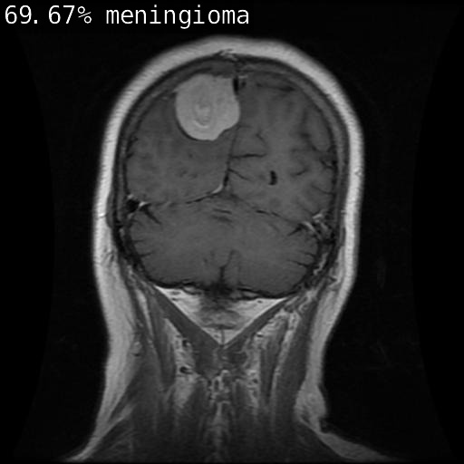

# Brain-Cancer-Detection-Project
This script is able to sort through various MRIs of brain cancer tumors and classify them into one of four categories (pituitary, meningioma, glioma, healthy). If this script were to be adapted by healthcare systems, it would be able to efficiently cut down the workload of healthcare workers as well as reduce patient wait times for information. I decided to make this project as I am interested in the various applications of machine learning in healthcare, and its ability to improve the current healthcare system. 

## The Algorithm

The data used in this project was taken from https://www.kaggle.com/datasets/rm1000/brain-tumor-mri-scans?select=meningioma

The data was then imported into the development environment where it was then split into three groups, testing, training, and validation. In the training process, the resnet.18 model was used and retrained with the new categories, being glioma, meningioma, pituitary, and healthy. By doing so, the model learns to recognize the distinct features of each form of cancer, to then be able to classify the MRI with its associated name. Glioma tumors appear on an MRI scan to have an irregular shape and a changing colour intensity- often blurring into the surrounding tissue. Meningioma tumors are small and round, often attached to the brain's lining. Finally, pituitary tumors are small, dense masses, often located in the base of the brain. A healthy MRI scan of the brain would appear to be symmetrical, with a clear distinction between white and gray matter. 

These are all key characteristics that help to distinguish the tumors from each other, which the model uses during training to effectively classify the type of brain cancer. To test the model, the percent accuracy was taken by comparing the amount of photos correctly identified, to the total number of images in the dataset. The results have been listed below:

* glioma 39.88%
* pituitary 85.80%
* meningioma 67.88%
* healthy 94.50%

The results support the models accuracy in identifying the type of brain tumor. The lowest percent accuracy occurred with the glioma tumor- this is likely a result of the lack of regularity of the tumor, with each tumor taking a unique, irregular shape, making it the most challenging to be detected. These tumors often blend into the surrounding tissue, compared to the other tumors that strike an apparent colour contrast again the brain tissue. Additionally, both meningioma and pituitary tumors have a more distinct shape and region in which they are located, thus yielding a higher percent accuracy. 
## Running this project

1. Install Jetson Inference: https://github.com/dusty-nv/jetson-inference 
2. Download the project repository
3. Change directories into the project repository

To process a folder, follow the steps listed below:
1. To make the script executable, run the command: `chmod +x pythonnet.py`
2. Run the command in the terminal: `./pythonnet.py [FOLDERNAME]`

To process a photo, follow the steps listed below:
1. Run the command in the terminal: `imagenet --model=resnet18.onnx --labels=labels.txt --input_blob=input_0 --output_blob=output_0 [IMAGE NAME] test.jpg`

[View a video explanation here](video link)

